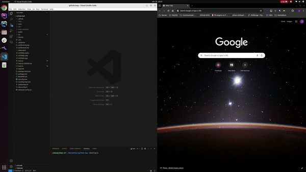

# githubadventure (Github x WorkAdventure)

## Features

This minimal extension allows you to directly access to workadventure world based on a local github project.

- **Start Adventure**: This feature welcomes you to the GitHub Adventure and provides an option to start the adventure. If you choose to start, it will open the adventure map in your default browser.

- **Open GitHub Adventure Homepage**: If you're not in a Git repository, this feature offers to open the GitHub Adventure homepage for you to access a remote Git repository.

## Usage

1. Download the extension from the [Visual Studio Code Marketplace](https://marketplace.visualstudio.com/items?itemName=JohanMickael.githubadventure).
2. ⚠️ Start The GithubAdventure API project. (Locally) [API](https://github.com/johan-mickael-myges/github-map)
3. Open a Git repository in Visual Studio Code.
3. Press `F1` to open the command palette.
4. Type `GitHub Adventure` and select the command to start the adventure.

## Getting Started (When developing)

1. Clone this repository.
2. Run `npm install` to install all the necessary dependencies.
3. Press `F5` to open a new window with the extension loaded.
4. Run the command from the command palette by pressing (`Ctrl+Shift+P` or `Cmd+Shift+P` on Mac) and typing `GitHub Adventure`.

## Environment Variables

This extension uses the following environment variables:

- `GIT_ADVENTURE_MAP_HOST`: The host URL for the GitHub Adventure Map.
- `GIT_ADVENTURE_MAP_API_HOST`: The API host for the GitHub Adventure Map.
- `WA_HOST`: The host URL for Work Adventure.

These variables are defined in the `.env` file. When adding new variables, make sure to add them to the `.vscode/launch.json` file as well to ensure that they are available when running the app in the debugger.

## Requirements

You must be able to run this project locally.

[GithubAdventure API: https://github.com/johan-mickael-myges/github-map](https://github.com/johan-mickael-myges/github-map)

## Known Issues

This extension only works with the GithubAdventure API running locally.
> You have to start the GithubAdventure API project in order to generate the dynamic maps. 

***Yeah, sorry, we do not have time to deploy the API on a server. But in another versions maybe ? ***

### Thanks
Thanks to the [WorkAdventure](https://workadventu.re/) team for allowing us to use their platform to create this extension.
This project is for educational purposes only.

**Enjoy!**
